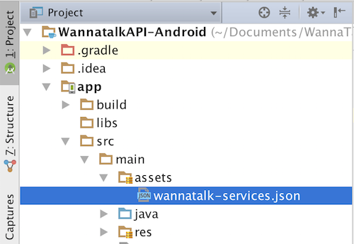

# wannatalkcore

Wannatalk Official Flutter plugin.

## Getting Started

Edit the `pubspec.yaml` file in your app directory to define the Wannatalk SDK dependency:

```yaml
dependencies:
  wannatalkcore: ^0.0.15
```

## iOS Setup
1. Request **WTService-Info.plist** from [wannatalk.ai](https://wannatalk.ai) and drag it into your application. When prompted, select **"Copy items if needed"** and continue.
2. Add below keys in your application's Info.plist

    ```
   <key>NSPhotoLibraryUsageDescription</key>
   <string>To save in-chat photos and videos</string>
   <key>NSContactsUsageDescription</key>
   <string>To locate friends already on the Wannatalk network</string>
   <key>NSCameraUsageDescription</key>
   <string>To take photos and videos to send to friends in-chat</string>
   <key>NSLocationWhenInUseUsageDescription</key>
   <string>To display it in map</string>
   <key>NSMicrophoneUsageDescription</key>
   <string>To record live photos and movies</string>
   ```
3. Add this line to your application pod file

    `pod 'WTExternalSDK', :git =>'https://github.com/edzehoo/WannatalkAPI-iOS.git', :tag => '1.7.0'`

4. That's it! Run the app

## To strip simulator architecture framework for your app submission
1. Copy **trim.sh** file into your project folder.
2. Create Run Script Phase in Build Phases of your application target.
3. Paste `"$SRCROOT/trim.sh"` inside the body of Run Script Phase.
4. Enable `Run script only when installing` and `Show environment variables in build log`.


## Android Setup
1. Request **wannatalk-services.json** from [wannatalk.ai](https://wannatalk.ai) and drag it into your application `assets` directory

2. Enable `multiDexEnabled` in your application **build.gradle**
   
   ```
   android {
       defaultConfig {
           // Enabling multidex support.
           multiDexEnabled true
       }
       ...
   }
   ```
3. Set colorPrimary, colorPrimaryDark and colorAccent attributes in app's color.xml (src/main/res/values/colors.xml)
4. Add `maven { url 'https://jitpack.io' }` in your project build.gradle
   
   ```
   allprojects {
       repositories {
           ...
                      
           maven { url 'https://jitpack.io' }
           
           ...
       }
       
   }
   ```
5. That's it! Run the app


# Usage
```dart
import 'package:wannatalkcore/wannatalkcore.dart';
```


## To link Wannatalk account
```dart
Wannatalkcore.login(onCompletion: (WTResult result) {
  if (result.success) {
  
  }
});
```

## To link Wannatalk account with user credentials

```dart
Wannatalkcore.silentLogin("<user_identifier>", { displayname: "name", key1: "Value1", key2: "Value2"}, onCompletion: (WTResult result) {
  if (result.success) {
  }
});
```

### To check login status
```dart
bool loggedIn = await Wannatalkcore.isUserLoggedIn;
```

## To unlink Wannatalk account
```dart
Wannatalkcore.logout(onCompletion: (WTResult result) {
});
```

### Wannatalk events

This callback will be triggered to notify events:
1. kWTEventTypeLogin: This event will be triggered when user login into wannatalk account. `evenResponse.success` indicates whether login successful or not. If fails, check error information at `eventResponse.error`.
2. kWTEventTypeLogout: This event will be triggered when user loggout from wannatalk account. `evenResponse.success` indicates whether logout successful or not. If fails, check error information at `eventResponse.error`.
3. kWTEventTypeProduct: This event will be triggered when user click on product image in chat page. `evenResponse.result` contains productID and storeID of the respective product image message.

```dart
    
Wannatalkcore.setMethodCallHandler(onReceivedEvent:(WTEventResponse eventResponse) {

    switch (eventResponse.eventType) {
        case WTEventResponse.kWTEventTypeProduct: {
            var result = eventResponse.result;
            if (result.success) {
                if (result.productID != null && result.storeID != null) {
                    print("ProductID: " + result.productID!);
                    print("StoreID: " + result.storeID!);
                }
            }
            else {
                // Error
                print(result.error);
            }
            break;
        }
    }
});
```


## To send text message to user
```dart

    String receiverUserIdentifier = "+60199299399499";  // Receiver mobile number with calling code
    
    String message = "Hi"; // Message you want to send to user
    Wannatalkcore.sendTextMessage(receiverUserIdentifier, message, onCompletion: (WTResult result) {
      if (result.success) {

      }
    });

```


## To send product image to user
```dart

    String receiverUserIdentifier = "+60199299399499"; // Receiver mobile number with calling code

    String productID = "<productID>"; // Product identifier 
    String productName = "<productName>"; // Optional // Product name
    String productPrice = "<productPrice>"; // Optional // Product price
    String productImageUrl = "https://upload.wikimedia.org/wikipedia/commons/a/ab/Apple-logo.png"; // Product image url
    String caption = "Can share details about this product?"; // caption will be sent to receiver along with image
    String storeID = "<storeID>"; // Store/Shop identifier 

    WTChatInput chatInput = WTChatInput.Product(productID, productName,
            productPrice, productImageUrl,
            caption, storeID);
        
    Wannatalkcore.sendProductImage(receiverUserIdentifier, chatInput, onCompletion: (WTResult result) {
      if (result.success) {

      }
    });
    

```


## To contact organization support
```dart

    String orgID = "your_organization_id";
    String channelID = "your_chat_channel_id";
    String message = "Hi";

    Wannatalkcore.contactOrganization(orgID, channelID, message, onCompletion: (WTResult result) {
      if (result.success) {

      }
    });

```


    
## HelpDesk
### To load your organization profile
```dart
Wannatalkcore.loadOrganizationProfile(autoOpenChat, onCompletion: (WTResult result){
});
```

## Collaboration
### To view all chats
```dart
Wannatalkcore.loadChats(onCompletion: (WTResult result) {
});
```
    
### To view all users
```dart
Wannatalkcore.loadUsers(onCompletion: (WTResult result) {
});
```

## Other

### To show or hide guide button
```dart
WannatalkConfig.showGuideButton(true); // default = true
```
### To enable or disable sending audio message
```dart
WannatalkConfig.allowSendAudioMessage(false);  // default = true
```
### To show or hide add participants option in new ticket page and chat item profile page
```dart
WannatalkConfig.allowAddParticipants(false);    // default = true
```
### To show or hide remove participants option in chat item profile
```dart
WannatalkConfig.allowRemoveParticipants(false); // default = false
```
### To show or hide welcome message
```dart
WannatalkConfig.showWelcomeMessage(false);            // default = false
```
### To show or hide Profile Info page
```dart
WannatalkConfig.showProfileInfoPage(false);           // default = true
```
### To create auto tickets: 
Chat ticket will create automatically when auto tickets is enabled, otherwise default ticket creation page will popup
```dart
WannatalkConfig.enableAutoTickets(true);           // default = false
```
### To show or hide close chat button in chat page
```dart
WannatalkConfig.showExitButton(true);               // default = false
```
### To show or hide participants in chat profile page
```dart
WannatalkConfig.showChatParticipants(false);          // default = true
```
### To enable or disbale chat profile page
```dart
WannatalkConfig.enableChatProfile(false);           // default = true
```
### To allow modify in chat profile page
```dart
WannatalkConfig.allowModifyChatProfile(false);       // default = true
```
### To set Inactive chat timeout:  
Chat session will end if user is inactive for timeout interval duration. If timeout interval is 0, chat session will not end automatically. The default timout interval is 1800 seconds (30 minutes).
```dart
double timeoutInterval = 1800; // Default Value: 1800 seconds ~ 30 minutes
WannatalkConfig.setInactiveChatTimeoutInterval(timeoutInterval);
```
